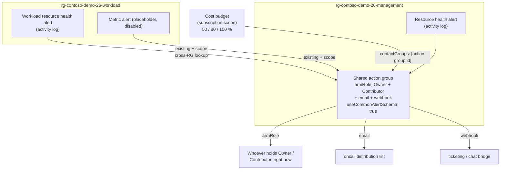

# 26 — Action groups that reach someone (a role, not a person)

An alert wired to one person's mailbox is a liability the day that person
changes teams: the rule stays green, the deployment stays healthy, and the page
goes to a mailbox nobody reads. This demo replaces "email a person" with "notify
whoever currently holds the **role**", using **one shared action group** that
every workload and every alert family reuses.

## What this demonstrates

- A single, central action group in a **management resource group**, reused by
  every workload resource group and every alert family — not one group per alert.
- **ARM role receivers** (Owner + Contributor) that reach whoever holds the role
  _right now_, so on-call routing survives people leaving with no Bicep change.
- Three receiver kinds side by side — `armRoleReceivers`, `emailReceivers`,
  `webhookReceivers` — all on the **common alert schema**.
- The cross-resource-group reuse pattern: `existing` + `scope` to consume an
  action group that lives in a different resource group.
- Three alert families on one group: **resource health** (activity log), a
  **cost budget**, and a placeholder **metric alert**.
- The classic 12-character `groupShortName` deployment failure, caught at build
  time with `@maxLength(12)`.

## Architecture



## Prerequisites

| Tool       | Version                | Needed for                              |
| ---------- | ---------------------- | --------------------------------------- |
| Azure CLI  | 2.60+                  | deploying, firing the test notification |
| Bicep CLI  | via `az bicep install` | compiling templates                     |
| PowerShell | 7+                     | the `.ps1` variants (optional)          |

To **deploy** you need rights to create resource groups and a subscription-scope
budget (Owner, or Contributor plus the budget permissions). The offline checks
(`verify.sh`) need no Azure login at all.

## Run it locally (the verify path)

The check to run before recording — it deploys nothing and needs no login:

```bash
cd 26-action-groups-that-reach-someone
./scripts/verify.sh
```

It compiles `infra/main.bicep` and every module with **zero warnings**,
compiles `main.bicepparam`, then `bash -n` parses every shell script and
AST-parses every PowerShell script.

```text
=== 1. Bicep compilation =======================================================
  PASS  main.bicep compiles cleanly
  PASS  action-group.bicep compiles cleanly
  PASS  budget.bicep compiles cleanly
  PASS  resource-health-alert.bicep compiles cleanly
  PASS  workload-alerts.bicep compiles cleanly
  PASS  main.bicepparam compiles

=== 2. Shell script syntax =====================================================
  PASS  bash -n cleanup.sh
  ... more ...

=== 3. PowerShell script syntax ================================================
  PASS  pwsh parse cleanup.ps1
  ... more ...

All checks passed.
```

PowerShell: `./scripts/verify.ps1` (delegates to `verify.sh` so both run the
identical checks).

## Deploy to Azure

Everything is `targetScope = 'subscription'`: the template creates both resource
groups itself.

```bash
# preview, changes nothing
./scripts/whatif.sh --email you@example.com

# deploy the shared group, the alerts and the budget
./scripts/deploy.sh --email you@example.com

# fire a REAL notification so the video has something to show
./scripts/fire-test-alert.sh \
  --resource-group rg-contoso-demo-26-management \
  --action-group contoso-demo-26-oncall \
  --email you@example.com
```

PowerShell equivalents: `./scripts/deploy.ps1 -AlertEmailAddress you@example.com`,
`./scripts/whatif.ps1`, `./scripts/fire-test-alert.ps1`.

Pass `--name-suffix ab12` (bash) / `-NameSuffix ab12` (pwsh) to every script if
several people share one subscription and need distinct resource-group names.

## What to show on camera

1. **`action-group.bicep`** — scroll the three receiver blocks. Land on
   `armRoleReceivers`: the two Owner/Contributor GUIDs, and the point that they
   resolve to _whoever holds the role now_, not a fixed mailbox.
2. **The 12-char trap** — show the `@maxLength(12)` on `groupShortName` and say
   why "contoso-demo-26-oncall" (22 chars) would fail the deployment.
3. **`main.bicep`** — subscription scope, two resource groups, one action group
   module in management consumed everywhere else.
4. **`workload-alerts.bicep`** — the `existing` + `scope` block. This is the
   cross-resource-group reuse: a second RG pointing at the shared group.
5. **`budget.bicep`** — `contactGroups: [actionGroupResourceId]`, and the note
   that budgets are evaluated asynchronously (hours, not seconds).
6. **`fire-test-alert.sh`** — run it live; the email lands and the role
   receivers resolve, without waiting for a real outage.
7. **The payoff line** — one shared group, and the day someone leaves the
   routing just keeps working.

## How it works

```text
infra/
├── main.bicep                          subscription scope; 2 resource groups
├── main.bicepparam
└── modules/
    ├── action-group.bicep              armRole + email + webhook, common schema
    ├── resource-health-alert.bicep     activity-log alert in the management RG
    ├── budget.bicep                    subscription-scope cost budget -> the group
    └── workload-alerts.bicep           existing + scope cross-RG reuse
```

The key ideas, in the Bicep:

- **Reach a role, not a person.** `armRoleReceivers` takes the built-in role
  definition GUIDs for Owner (`8e3af657-…`) and Contributor (`b24988ac-…`) —
  public Azure constants — and notifies whoever currently holds them.

  ```bicep
  armRoleReceivers: [
    { name: 'subscription-owners',       roleId: ownerRoleId,       useCommonAlertSchema: true }
    { name: 'subscription-contributors', roleId: contributorRoleId, useCommonAlertSchema: true }
  ]
  ```

- **One name, no drift.** `main.bicep` computes the action group name once and
  passes it both to the module that _creates_ the group and to the module that
  _looks it up_ cross-RG, so the `existing` reference can never go stale:

  ```bicep
  resource sharedActionGroup 'Microsoft.Insights/actionGroups@2023-01-01' existing = {
    name: actionGroupName
    scope: resourceGroup(managementResourceGroupName)
  }
  ```

- **The budget borrows the group.** A budget has no role receivers of its own;
  it references the action group by resource ID through `contactGroups`, which
  is exactly why routing budgets through a shared group is the clean way to
  reach on-call.

- **Common alert schema everywhere.** Every receiver sets
  `useCommonAlertSchema: true`, so a single downstream handler sees one payload
  shape across all alert families — see
  [`docs/common-alert-schema.md`](docs/common-alert-schema.md).

## Costs

- **Action groups are free.** You are not billed for the group or its receivers.
- **Activity log alerts (resource health) are free.** Activity-log-based alert
  rules carry no charge.
- **Budgets are free.** `Microsoft.Consumption/budgets` costs nothing; it just
  reads your existing cost data.
- **Notifications:** email and webhook notifications are free. Only SMS / voice
  receivers (not used here) carry a small per-message charge.
- **The placeholder metric alert** is deployed **disabled**, so it does not
  incur the small per-metric-timeseries alert-rule fee. Metric alert rules do
  cost a few cents per monitored time series per month once enabled.

Net: this demo is effectively free to leave running. Delete it anyway when
you are done, to keep your subscription tidy.

## Clean up

```bash
./scripts/cleanup.sh --yes
```

This deletes both resource groups and the subscription-scoped budget (budgets
survive resource-group deletion, so the script removes it explicitly).
PowerShell: `./scripts/cleanup.ps1 -Force`.

## Further reading

- [Create and manage action groups](https://learn.microsoft.com/azure/azure-monitor/alerts/action-groups)
- [ARM role receivers in action groups](https://learn.microsoft.com/azure/azure-monitor/alerts/action-groups#azure-resource-manager-role)
- [Test an action group](https://learn.microsoft.com/azure/azure-monitor/alerts/action-groups-test)
- [Create and manage budgets](https://learn.microsoft.com/azure/cost-management-billing/costs/tutorial-acm-create-budgets)
- [Common alert schema](https://learn.microsoft.com/azure/azure-monitor/alerts/alerts-common-schema)
