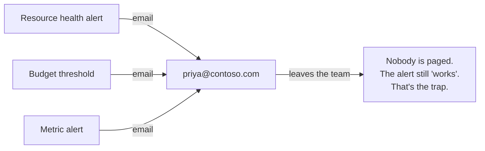
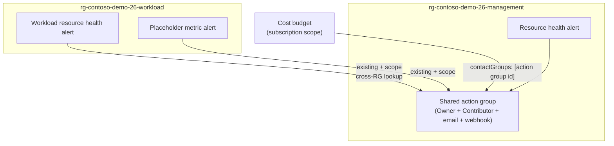

# The action group that reaches a role, not a person

**Audience:** Azure platform / observability engineers
**Length:** ~5 minutes
**Source:** Distilled from a production platform where one shared action group,
scoped to ARM roles, backs every alert family across every workload. Working,
anonymised demo: this repo (`26-action-groups-that-reach-someone`).

## Hook (0:00 - 0:30)

"Here's an alert rule a lot of teams ship: when something breaks, email
Priya. Priya wrote the service, Priya knows the runbook, Priya gets the page.
It works right up until the day Priya changes teams — and now the alert fires
into a mailbox nobody reads, and the people who *should* act never find out.
In this video I'll replace 'email a person' with 'notify whoever currently
holds the role', using one shared action group that every alert in the whole
platform reuses."

## The liability: an alert wired to a mailbox



An action group with a single `emailReceivers` entry pointed at an individual
is a **single point of human failure**. Worse, it fails *silently*: the rule
stays healthy, the deployment stays green, and the gap only shows up during
the incident when the page goes nowhere.

## The fix: receivers that point at a role

```bicep
resource actionGroup 'Microsoft.Insights/actionGroups@2023-01-01' = {
  name: name
  location: 'Global'
  properties: {
    groupShortName: groupShortName   // <= 12 chars, hard limit
    enabled: true
    armRoleReceivers: [
      { name: 'subscription-owners',       roleId: '8e3af657-a8ff-443c-a75c-2fe8c4bcb635', useCommonAlertSchema: true }
      { name: 'subscription-contributors', roleId: 'b24988ac-6180-42a0-ab88-20f7382dd24c', useCommonAlertSchema: true }
    ]
    emailReceivers:   [ { name: 'oncall-distribution', emailAddress: alertEmailAddress, useCommonAlertSchema: true } ]
    webhookReceivers: [ { name: 'ticketing-webhook', serviceUri: webhookUrl, useCommonAlertSchema: true } ]
  }
}
```

`armRoleReceivers` is the star. Those two GUIDs are the public, built-in Azure
role definitions for **Owner** and **Contributor** — they never change. The
action group resolves them *at fire time* to whoever holds that role on the
scope right now. Nobody maintains a list. When Priya leaves and loses her role
assignment, she stops getting paged automatically, and her replacement starts
— no Bicep change, no ticket, no "who do we still email?" archaeology.

The email receiver stays in the demo for one honest reason: so you actually
see mail land on camera. In production that address is a shared distribution
list, never a human. The webhook is where a ticketing or chat bridge hooks in.

## The 12-character trap

```bicep
// "contoso-demo-26-oncall" is 22 characters. Deployment REJECTED.
@maxLength(12)
param groupShortName string   // becomes the SMS/email prefix
```

`groupShortName` has a hard limit of 12 characters, and it is one of the most
common action-group deployment failures. It becomes the prefix on every SMS
and email the group sends. Enforce it with `@maxLength(12)` so the build
catches it, not a failed 3 a.m. deployment.

## One group, many alert families, across resource groups

This is where it stops being a slogan. The template is `targetScope =
'subscription'` and creates two resource groups on purpose:



The workload resource group does **not** create its own action group. It
references the shared one that already lives in the management resource group:

```bicep
resource sharedActionGroup 'Microsoft.Insights/actionGroups@2023-01-01' existing = {
  name: actionGroupName
  scope: resourceGroup(managementResourceGroupName)   // <- another RG
}
```

`existing` + `scope` is the whole pattern. Every new workload, every new alert
family, points at the same group. Change the on-call routing once, and every
alert in the platform follows.

## The budget is wired to the same group — with a twist

```bicep
notifications: {
  actualEightyPercent: {
    threshold: 80
    thresholdType: 'Actual'
    contactGroups: [ actionGroupResourceId ]   // the shared group's role receivers
  }
}
```

A budget has no role-receiver concept of its own; it borrows the action
group's via `contactGroups`. Two things to say out loud: budget notifications
need the action group **resource ID**, and budgets are evaluated
**asynchronously** — hours, not seconds. It is a slow-burn signal, unlike the
resource health alert next to it.

## Prove it on camera without waiting for an outage

```bash
./scripts/fire-test-alert.sh \
  --resource-group rg-contoso-demo-26-management \
  --action-group contoso-demo-26-oncall \
  --email you@example.com
```

Azure Monitor's test-notifications API fires a **real** notification through
the group — email lands, role receivers resolve — without waiting for an
actual alert. That's your on-camera payoff.

## Why this holds together: the common alert schema

Every receiver sets `useCommonAlertSchema: true`, so resource health, metric
and budget alerts all arrive in one stable envelope. That is what keeps a
single shared group cheap to extend: the webhook handler never needs a new
branch when you add the next alert family. Details in
[`docs/common-alert-schema.md`](common-alert-schema.md).

## Wrap-up (4:30 - 5:00)

"An alert that emails a person is a liability with a name on it. Point your
receivers at a role instead, put that one action group in a management
resource group, and reuse it from every workload and every alert family with
`existing` + `scope`. The day someone leaves, the routing just... keeps
working. That's the entire idea, and it's about forty lines of Bicep."

## Sources in this repo

- `infra/modules/action-group.bicep` — the three receiver kinds side by side,
  `armRoleReceivers` front and centre, and the `@maxLength(12)` short-name guard
- `infra/main.bicep` — subscription scope, two resource groups, one shared group
- `infra/modules/workload-alerts.bicep` — the cross-RG `existing` + `scope` reuse
- `infra/modules/budget.bicep` — a cost budget borrowing the group via `contactGroups`
- `infra/modules/resource-health-alert.bicep` — the same-RG resource health alert
- `scripts/fire-test-alert.sh` — a real notification, on demand, for the recording
- `docs/common-alert-schema.md` — the payload shape that keeps one group extensible
