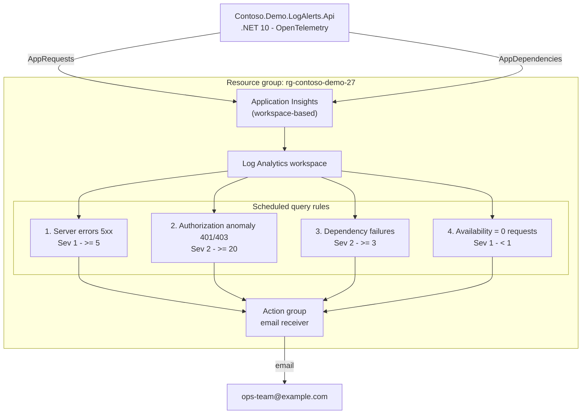

# 27 - Log alerts on Kusto queries, without leaking customer data

> An Azure Monitor log alert is just a KQL query on a schedule. The catch:
> **whatever the query returns becomes the alert** - it lands in the email, the
> webhook and the ticket. A stray `| take 10` in an alert rule quietly copies
> customer request rows into your inbox on every evaluation. This demo builds
> four log alerts the safe way: each query returns a count and nothing else.

Everything here is anonymous and self-contained. The fictional company is
**Contoso**, running a widget catalog. Nothing depends on another demo folder.

## What this demonstrates

- **Log alerts are privacy-critical.** The query result is copied into every
  notification channel, so an alert query must return an aggregate count and
  never per-request rows (URLs, client IPs, user ids, headers, SQL text).
- **Four `scheduledQueryRules`** over the app's own telemetry: server errors,
  authorization anomaly, dependency failures, and availability.
- **Alerting on the _absence_ of telemetry** - the availability rule fires when
  the request count drops to zero, the alert people forget to write.
- **`metricMeasureColumn` + a single `summarize` column** as the pattern that
  makes threshold logic explicit and reviewable.
- **The settings that silently break log alerts**: `evaluationFrequency` vs
  `windowSize`, `failingPeriods`, and `skipQueryValidation`.

## Architecture



| File                                       | What it does                                         |
| ------------------------------------------ | ---------------------------------------------------- |
| `infra/main.bicep`                         | Orchestrates everything, resource-group scope        |
| `infra/modules/log-analytics.bicep`        | Workspace-based Log Analytics workspace              |
| `infra/modules/application-insights.bicep` | Workspace-based Application Insights                 |
| `infra/modules/action-group.bicep`         | Email receiver, common alert schema                  |
| `infra/modules/log-alerts.bicep`           | The four scheduled query rules                       |
| `queries/*.kql`                            | The same four queries, runnable standalone           |
| `src/dotnet/.../Api`                       | .NET 10 API that emits telemetry + failure endpoints |

### The four alerts

| #   | Alert                 | Fires when                          | Severity | Owner               | Source table      |
| --- | --------------------- | ----------------------------------- | -------- | ------------------- | ----------------- |
| 1   | Server errors         | `>= 5` HTTP 5xx in 5 min            | 1        | Platform Operations | `AppRequests`     |
| 2   | Authorization anomaly | `>= 20` HTTP 401/403 in 5 min       | 2        | Security Operations | `AppRequests`     |
| 3   | Dependency failures   | `>= 3` failed dependencies in 5 min | 2        | Platform Operations | `AppDependencies` |
| 4   | Availability          | `< 1` request in 5 min              | 1        | Platform Operations | `AppRequests`     |

Every query ends in a single `summarize <Name> = count()/countif(...)` producing
one numeric column, wired to the threshold through `metricMeasureColumn`. See
[`docs/privacy-safe-kql.md`](docs/privacy-safe-kql.md) for the good/bad pairs.

## Prerequisites

- .NET SDK 10.0 or newer
- Azure CLI 2.60+ and `az bicep` (`az bicep upgrade`)
- An Azure subscription and `az login`
- `curl` (for `generate-failures.sh`)
- Optional: `pwsh` 7+ if you prefer the PowerShell scripts

## Run it locally

The API runs without Azure - it just won't export telemetry unless a connection
string is set. This is enough to exercise every endpoint.

```bash
dotnet run --project src/dotnet/Contoso.Demo.LogAlerts.Api
# in another terminal:
curl http://localhost:5027/health
curl http://localhost:5027/widgets
curl -i http://localhost:5027/widgets/boom          # 500
curl -i http://localhost:5027/orders/secret         # 401
curl -i "http://localhost:5027/orders/secret?forbidden=true"  # 403
curl -i http://localhost:5027/widgets/WIDGET-001/supplier      # 502, failed dependency
```

Verify the whole demo offline - **run this before recording**:

```bash
./scripts/verify.sh
```

It compiles the Bicep with zero warnings, compiles `main.bicepparam`, proves
`queries/*.kql` have not drifted from the KQL embedded in the alert rules,
builds the .NET 10 API with warnings-as-errors, and parses every `.sh` and
`.ps1`. If you are signed in to Azure it also validates the KQL against a live
workspace, because a rule with invalid KQL deploys happily and then never fires.

```
=== 1. Bicep compilation =======================================================
  PASS  main.bicep and all modules compile without warnings
  PASS  main.bicepparam compiles

=== 2. KQL drift check =========================================================
  PASS  queries/*.kql match the KQL embedded in log-alerts.bicep

=== 3. .NET 10 API =============================================================
  PASS  dotnet build (net10.0, warnings as errors)

=== 4. Script syntax ===========================================================
  PASS  bash -n cleanup.sh
  ... 13 more ...

=== 5. Live KQL validation =====================================================
  PASS  all four queries are valid KQL against a live workspace

All checks passed.
```

PowerShell: `./scripts/verify.ps1`.

## Deploy to Azure

```bash
# Preview first
./scripts/whatif.sh --email you@example.com

# Deploy workspace, App Insights, action group and the four rules
./scripts/deploy.sh --email you@example.com

# Optional: a suffix keeps global names unique
./scripts/deploy.sh --email you@example.com --name-suffix ab12
```

The deploy prints the Application Insights connection string. Point the API at
it and drive some failures:

```bash
export APPLICATIONINSIGHTS_CONNECTION_STRING='<printed by deploy>'
dotnet run --project src/dotnet/Contoso.Demo.LogAlerts.Api &

./scripts/generate-failures.sh --url http://localhost:5027 --scenario server-errors --count 30
./scripts/show-alerts.sh --resource-group rg-contoso-demo-27
```

PowerShell equivalents: `deploy.ps1`, `generate-failures.ps1`, `show-alerts.ps1`
(same arguments as `-Url`, `-Scenario`, `-Count`).

`generate-failures` works against a locally running API **or** a deployed URL -
pass whatever `--url` reaches the app.

## How it works

- **The app** (`src/dotnet/.../Api`) is a .NET 10 minimal API using the
  **Azure Monitor OpenTelemetry distro** (`Azure.Monitor.OpenTelemetry.AspNetCore`).
  `UseAzureMonitor()` turns on request and dependency collection; incoming calls
  land in `AppRequests`, the failing outbound call lands in `AppDependencies`.
  Its OpenTelemetry `service.name` (`contoso-widget-api`) becomes `AppRoleName`,
  which every rule filters on - that string is the contract between app and rule.
- **The rules** (`infra/modules/log-alerts.bicep`) each embed their KQL as a
  triple-quoted string that is byte-identical to the matching file in
  `queries/`. `scripts/validate-queries.sh` fails the build if they drift, so
  the `queries/` folder is the real, runnable source of truth.
- **The safe pattern**: `timeAggregation: 'Total'`, one `summarize` column, and
  `metricMeasureColumn` pointing at it, compared to a `threshold`.

### The settings people get wrong

- **`evaluationFrequency` vs `windowSize`** - _how often_ the rule runs versus
  _how much history_ each run sees. They are independent. Here both are `PT5M`
  and the KQL uses `ago(5m)` to match; if the window were smaller than the KQL's
  time filter, the rule would silently see fewer rows and fire late or never.
- **`failingPeriods`** - `numberOfEvaluationPeriods: 1, minFailingPeriodsToAlert: 1`
  means a single bad window fires immediately. Raise these to require several
  consecutive breaches (fewer false alarms, slower to fire).
- **`metricMeasureColumn` is mandatory** once you compare a numeric column to a
  threshold. It names the single `summarize` column the threshold applies to.
  Omit it and the deployment fails - which is the good kind of failure.
- **`skipQueryValidation: true`** - a brand-new workspace has no `AppRequests`
  rows until the app runs, so validating the query at deploy time would fail on
  a table that legitimately does not exist yet. Skipping it lets the rule deploy;
  `validate-queries.sh` is how you check the KQL instead.

## Clean up

```bash
./scripts/cleanup.sh --resource-group rg-contoso-demo-27 --yes
```

PowerShell: `./scripts/cleanup.ps1 -ResourceGroup rg-contoso-demo-27 -Force`.

## Costs

This demo deploys billable resources - **delete them when you are done.**

- **Log Analytics workspace** - billed per GB ingested and per GB retained.
  This demo emits a trivial amount of telemetry, so the cost is a few cents, but
  it is _not_ zero and it accrues for as long as the workspace exists.
- **Scheduled query rules** - Azure Monitor bills **per log-alert rule, per
  month** (prorated). Four rules is four line items; leaving them running for
  weeks after the recording is the real cost here, not the ingestion.
- **Application Insights** - workspace-based, so its data is billed through the
  workspace above. No separate charge.
- **Action group** - email notifications are free at this volume.

`./scripts/cleanup.sh` deletes the whole resource group, which stops every one
of these at once. Do it as soon as the recording is in the can.

## Further reading

- [Create a log search alert rule](https://learn.microsoft.com/azure/azure-monitor/alerts/alerts-create-log-alert-rule)
- [Log alerts pricing](https://learn.microsoft.com/azure/azure-monitor/cost-usage#alert-rules)
- [Manage personal data in Log Analytics](https://learn.microsoft.com/azure/azure-monitor/logs/personal-data-mgmt)
- [Azure Monitor OpenTelemetry distro for .NET](https://learn.microsoft.com/azure/azure-monitor/app/opentelemetry-enable?tabs=aspnetcore)
