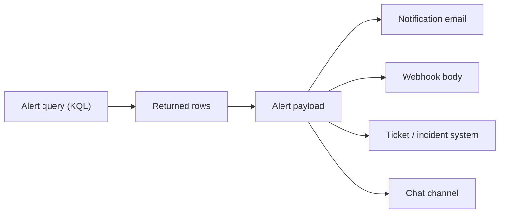

# Privacy-safe KQL for alert rules

Everything below was checked against the live Azure API and the Microsoft Learn
documentation. The details matter, because the difference between a safe alert
and a data-exfiltration channel is a single line of KQL that nobody reviews.

## The one idea

**Whatever your alert query returns is the alert.**

A scheduled query rule runs your KQL, takes the rows that come back, and copies
them into the alert. From there they fan out:



Every column, every row, in all of those places, forwarded to whoever is on the
distribution list and stored in whatever ticketing system sits behind the
webhook. None of those places is your Log Analytics workspace with its access
controls, its retention policy and its purge tooling. They are inboxes and SaaS
databases.

So the rule is blunt: **an alert query returns a count and nothing else.**

## The query that looks helpful and leaks

Here is the one that shows up in every "quick, add an alert" pull request:

```kusto
// BAD - looks convenient, exfiltrates customer data on every evaluation
AppRequests
| where TimeGenerated > ago(5m)
| where ResultCode >= 500
| take 10
```

"I added `| take 10` so the on-call engineer can see examples in the email."
What actually lands in the inbox, every five minutes, for as long as the
condition holds:

- `Url` - the full request path and query string, which routinely carries ids,
  emails, tokens and search terms
- `ClientIP` - a personal identifier under most privacy regimes
- `UserAuthenticatedId` / `UserId` - exactly who
- request and response headers if your instrumentation captures them

That query never fails. It deploys cleanly, it fires correctly, and it quietly
turns your alerting pipeline into an unmanaged copy of your request logs.

## The same alert, done safely

```kusto
// GOOD - one number, no request data leaves the workspace
AppRequests
| where TimeGenerated > ago(5m)
| where AppRoleName =~ 'contoso-widget-api'
| summarize ServerErrorCount = countif(toint(ResultCode) >= 500)
```

One row, one numeric column. The alert says "there were 12 server errors in the
last five minutes." That is the whole job of the alert: tell you *that* it is
happening and *how much*. The investigation happens afterwards, in the
workspace, by an engineer with the right access - not in an email thread.

The threshold is wired to that column with `metricMeasureColumn` in the rule:

```bicep
criteria: {
  allOf: [
    {
      query: serverErrorsQuery
      timeAggregation: 'Total'
      metricMeasureColumn: 'ServerErrorCount'  // the single numeric column
      operator: 'GreaterThanOrEqual'
      threshold: 5
      failingPeriods: { numberOfEvaluationPeriods: 1, minFailingPeriodsToAlert: 1 }
    }
  ]
}
```

## Good/bad pairs, by rule

### Server errors

```kusto
// BAD
AppRequests | where ResultCode >= 500 | project TimeGenerated, Url, ClientIP, ResultCode
```
```kusto
// GOOD
AppRequests
| where TimeGenerated > ago(5m)
| where AppRoleName =~ 'contoso-widget-api'
| summarize ServerErrorCount = countif(toint(ResultCode) >= 500)
```
`Url` and `ClientIP` are the leak. The count is all the alert needs.

### Authorization anomaly (this one is the sharpest)

```kusto
// BAD - a security alert that emails the very credentials it is about
AppRequests | where ResultCode in (401, 403) | project ClientIP, UserAuthenticatedId, Url
```
```kusto
// GOOD
AppRequests
| where TimeGenerated > ago(5m)
| where AppRoleName =~ 'contoso-widget-api'
| summarize AuthFailureCount = countif(toint(ResultCode) in (401, 403))
```
A burst of 401/403 is a potential credential-stuffing or misconfiguration
incident. The worst possible reaction is to email the client IPs and user ids to
a distribution list. Alert on the count; pull the identity signals server-side,
under access control, once you are actually investigating.

### Dependency failures

```kusto
// BAD - connection strings and SQL text in your inbox
AppDependencies | where Success == false | project Target, Data, DependencyType
```
```kusto
// GOOD
AppDependencies
| where TimeGenerated > ago(5m)
| where AppRoleName =~ 'contoso-widget-api'
| where Success == false
| summarize DependencyFailureCount = count()
```
`Data` is the dependency command - for a database dependency that is the SQL
text, parameters and all. `Target` can carry the host and connection details.
Neither belongs in a notification.

### Availability - the inverted one

```kusto
// GOOD - fires when the count drops to zero
AppRequests
| where TimeGenerated > ago(5m)
| where AppRoleName =~ 'contoso-widget-api'
| summarize RequestCount = count()
```
Wired with `operator: 'LessThan'`, `threshold: 1`. There is nothing to leak here
because there is nothing to return - and that is the point. This alert fires on
**silence**. Every other rule fires when something bad is recorded; this one
fires when *nothing* is recorded, which is what a crash, a bad deploy or broken
egress actually looks like. `summarize count()` with no `by` always returns
exactly one row, so a zero genuinely reads as "fewer than one request", not as
"the query found nothing and stayed quiet".

## Why `summarize ... count()` and not `| where ... | count`

Two subtle reasons, both about making the rule behave:

1. **A single named numeric column is what `metricMeasureColumn` binds to.** The
   rule compares that column to `threshold`. Give it a column and a number and
   the semantics are explicit: "alert when `ServerErrorCount >= 5`". This is
   more honest than the older "alert when the query returns any rows" pattern,
   where the threshold logic is hidden inside the KQL.

2. **`summarize` with no `by` always produces exactly one row.** That is what
   makes the availability rule possible: `count()` returns `0`, the rule sees
   `0 < 1`, and it fires. A query that filters rows away first would return
   *no* rows, and "no rows" is not "zero" - the rule would simply never
   evaluate the condition.

## Settings that quietly break the rule

| Setting | Gets it wrong by | Correct here |
|---|---|---|
| `evaluationFrequency` vs `windowSize` | conflating "how often it runs" with "how much history each run sees" | both `PT5M`, and the KQL uses `ago(5m)` to match |
| `metricMeasureColumn` | omitted when comparing a numeric column to a threshold - deployment fails | set to the one `summarize` column on every rule |
| `failingPeriods` | left at several periods, so a real breach waits minutes to fire | `1` of `1` - one bad window fires immediately |
| `skipQueryValidation` | left `false` on a fresh workspace, so deploy fails because `AppRequests` has no rows yet | `true`, because an empty workspace legitimately has no telemetry tables until the app runs |

## References

- [Create a log search alert rule](https://learn.microsoft.com/azure/azure-monitor/alerts/alerts-create-log-alert-rule)
- [Log alert query best practices](https://learn.microsoft.com/azure/azure-monitor/alerts/alerts-processing-rules)
- [Application Insights data model - requests](https://learn.microsoft.com/azure/azure-monitor/app/data-model-complete)
- [Personal data in Log Analytics](https://learn.microsoft.com/azure/azure-monitor/logs/personal-data-mgmt)
