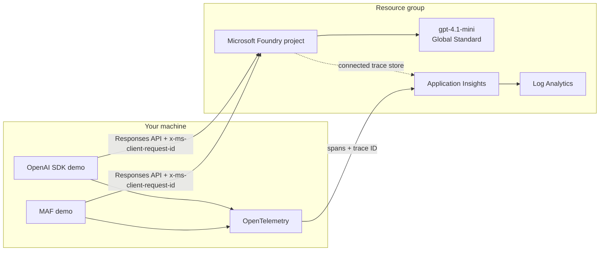

# 28 - Troubleshoot Microsoft Foundry requests with headers and traces

When a model call is slow or fails, "the agent was slow" is not enough for a
useful support case. This demo produces the evidence that lets you separate
client time, Foundry processing time, throttling, routing and application
orchestration.

It contains two deliberately small applications over one shared deployment:

1. **Direct OpenAI SDK** - the transparent baseline, based on the reproduction
   from [Responses with Microsoft Foundry models are very slow](https://jan-v.nl/post/2026/responses-with-microsoft-foundry-models-are-very-slow/).
2. **Microsoft Agent Framework (MAF)** - the same request, correlation header,
   wire output and streaming switch, with MAF's agent-level OpenTelemetry spans.

Both apps print a redacted HTTP transcript. Authentication headers never appear
in the output.

## What this demonstrates

- Add a caller-owned `x-ms-client-request-id` UUID to every model call.
- Capture the service-owned `apim-request-id` / `x-request-id` returned by
  Foundry. These are the identifiers Azure Support can use to find the call.
- Capture processing, streaming, model, region, cluster, tier and rate-limit
  response headers instead of guessing at the cause.
- Compare the exact request with the correlation header absent and present.
- Compare `stream=true` and `stream=false` without changing the prompt.
- Emit a complete client-side trace to the Application Insights resource linked
  to the Foundry project, and print its 32-character trace ID.
- See the important boundary: HTTP request IDs help Microsoft investigate the
  managed service; OpenTelemetry trace IDs help you investigate your app/agent.

## Architecture



| File | Responsibility |
| --- | --- |
| `infra/main.bicep` | Orchestrates Foundry and monitoring modules |
| `infra/modules/foundry.bicep` | Account, project, model deployment, App Insights connection and Azure AI User role |
| `infra/modules/monitoring.bicep` | Log Analytics, Application Insights and trace-reader role |
| `src/diagnostics.py` | Correlation IDs, safe wire recorder, response-header allowlist and tracing setup |
| `src/openai_headers.py` | Direct OpenAI SDK baseline |
| `src/maf_headers.py` | MAF `Agent` flow using per-call `extra_headers` |

## The headers to keep

There is only one header this demo asks the application to create. The other
values are returned by the service and must be logged alongside it.

| Direction | Header | Why it matters |
| --- | --- | --- |
| Request | `x-ms-client-request-id` | Your UUID. It connects application logs, the HTTP exchange and a support ticket even if the request fails before a response ID is returned. Generate a new value per model request. |
| Response | `apim-request-id` | Foundry gateway request ID documented for troubleshooting. This is the first ID to include in a support case. |
| Response | `x-request-id` | Backend request ID. Preserve it when present. |
| Response | `openai-processing-ms` | Service-side processing time. Compare it with client wall clock to locate network/SDK overhead. |
| Response | `azureai-fe-is-streaming` | How the Foundry front end classified the request. |
| Response | `x-ms-served-model` | Actual model/version that served the deployment alias. |
| Response | `x-ms-region` | Serving region. |
| Response | `azureml-served-by-cluster` | Backend cluster, when exposed. Useful for repeated cluster-specific failures. |
| Response | `azureai-fe-requested-service-tier` | Requested/selected service tier, when exposed. |
| Response | `x-ratelimit-*` | Remaining and limit values for request/token quota. These help distinguish throttling from latency. |

`traceparent` is a separate concern. OpenTelemetry creates and propagates it to
correlate spans. Do not replace the HTTP request IDs with the trace ID; record
both because they answer different questions.

## Prerequisites

- Python 3.11 or newer
- Azure CLI 2.60 or newer, including Bicep
- An Azure subscription, `az login`, and permission to create resources and
  role assignments
- Available Global Standard quota for `gpt-4.1-mini` in the selected location
- PowerShell 7 only if you prefer the `.ps1` scripts

Package versions are pinned in `requirements.txt`. In particular, the MAF demo
uses `agent.run(..., client_kwargs={"extra_headers": ...})`, which reaches the
underlying Responses API call in the pinned version. The on-screen wire output
is the proof: if the header is not visible there, it was not sent.

## Verify before recording

```bash
./scripts/verify.sh
```

This compiles Bicep with zero warnings, compiles both Python applications, and
parses every Bash and PowerShell script. It does not create Azure resources.

## Deploy

Preview first:

```bash
./scripts/whatif.sh --name-suffix jan28
```

Deploy the Foundry project, model and trace store:

```bash
./scripts/deploy.sh --name-suffix jan28
```

The script obtains the signed-in user's object ID, grants Azure AI User only on
the demo project, and writes local configuration to `.azure-outputs.env` with
owner-only permissions. The file is ignored by Git.

If that model version or capacity is unavailable in your subscription, choose a
supported value explicitly:

```bash
./scripts/deploy.sh \
  --location swedencentral \
  --model-name gpt-4.1-mini \
  --model-version 2025-04-14 \
  --model-capacity 10
```

PowerShell: `./scripts/whatif.ps1` and `./scripts/deploy.ps1`.

## Run the direct OpenAI baseline

The default run makes two streamed calls: first without the correlation header,
then with it. `--wire` is on by default.

```bash
./scripts/run.sh openai
```

Useful recording variations:

```bash
# One request with the recommended header
./scripts/run.sh openai --headers with

# Reproduce the buffered Responses API path from the blog post
./scripts/run.sh openai --headers with --no-stream

# Keep the concise summary but hide the full HTTP request
./scripts/run.sh openai --headers both --no-wire
```

For every call, point out these three lines first:

```text
x-ms-client-request-id: <your UUID>
apim-request-id: <Foundry request ID>
openai-processing-ms: <service time>
```

Then compare `openai-processing-ms` with `Client wall clock`. A large client-only
gap points outside model processing; two similarly large numbers point toward
the service path.

## Run the Microsoft Agent Framework flow

```bash
./scripts/run.sh maf
```

The important MAF call is intentionally visible in `src/maf_headers.py`:

```python
response = await agent.run(
    prompt,
    client_kwargs={"extra_headers": {"x-ms-client-request-id": request_id}},
)
```

Use the same switches as the OpenAI demo:

```bash
./scripts/run.sh maf --headers with --stream
./scripts/run.sh maf --headers with --no-stream
```

MAF natively emits GenAI spans when an OpenTelemetry provider is configured.
The app also adds one parent span named `demo28.maf.invoke`, so the printed trace
ID identifies the complete local invocation.

## What the full request trace contains

With `--wire`, each invocation shows:

1. HTTP method and exact Foundry project URL.
2. Every outbound request header, with credentials/cookies replaced by
   `<redacted>`.
3. The complete JSON request body, including `model`, `input`, `stream` and
   `store`.
4. HTTP status and the diagnostic response-header allowlist.
5. Parsed answer, client wall-clock duration and OpenTelemetry trace ID.

The response body is consumed by the SDK/MAF and printed as the parsed answer.
The recorder does not buffer a streaming response a second time; doing so would
change the behavior being measured.

## Find the call in Microsoft Foundry

Trace ingestion is asynchronous, so allow a few minutes after the first run.

1. Open [Microsoft Foundry](https://ai.azure.com) and select the deployed
   project (`project-demo28-<suffix>`).
2. Open **Agents**, then **Traces**.
3. Select a time range covering the run and paste the printed **Trace ID** into
   search. Open the result to inspect the parent invocation and MAF/model spans.
4. Check span duration and status first. Enable prompt/response capture only for
   safe demo data; telemetry can otherwise contain customer content.
5. If the Foundry trace view is delayed, open the connected Application Insights
   resource, choose **Transaction search**, and search for the same operation ID.

For a Microsoft support case, provide a compact evidence bundle instead of only
the OpenTelemetry trace:

- UTC timestamp and timezone
- Foundry account/project and model deployment
- `x-ms-client-request-id`
- `apim-request-id` and `x-request-id`
- `openai-processing-ms` and client wall-clock time
- streaming flag, status code, region, cluster and rate-limit headers
- printed OpenTelemetry Trace ID
- a minimal redacted request body that reproduces the issue

The Foundry portal trace helps you inspect your end-to-end application. The
`apim-request-id` is what lets Microsoft correlate the managed gateway/backend
request that your tenant cannot inspect directly.

## Clean up

```bash
./scripts/cleanup.sh --resource-group rg-demo28-foundry-diagnostics --yes
```

PowerShell: `./scripts/cleanup.ps1 -ResourceGroup rg-demo28-foundry-diagnostics`.

The model deployment, Log Analytics workspace and Application Insights are
billable. Delete the resource group after recording.

## Further reading

- [The original latency investigation and Gist](https://jan-v.nl/post/2026/responses-with-microsoft-foundry-models-are-very-slow/)
- [Set up tracing for AI agents in Microsoft Foundry](https://learn.microsoft.com/azure/foundry/observability/how-to/trace-agent-setup)
- [Microsoft Agent Framework observability samples](https://github.com/microsoft/agent-framework/tree/main/python/samples/02-agents/observability)
- [Foundry Responses REST reference](https://learn.microsoft.com/rest/api/aifoundry/azureopenai/responses)
- [Foundry REST troubleshooting correlation header](https://learn.microsoft.com/azure/ai-services/reference/rest-api-resources)
